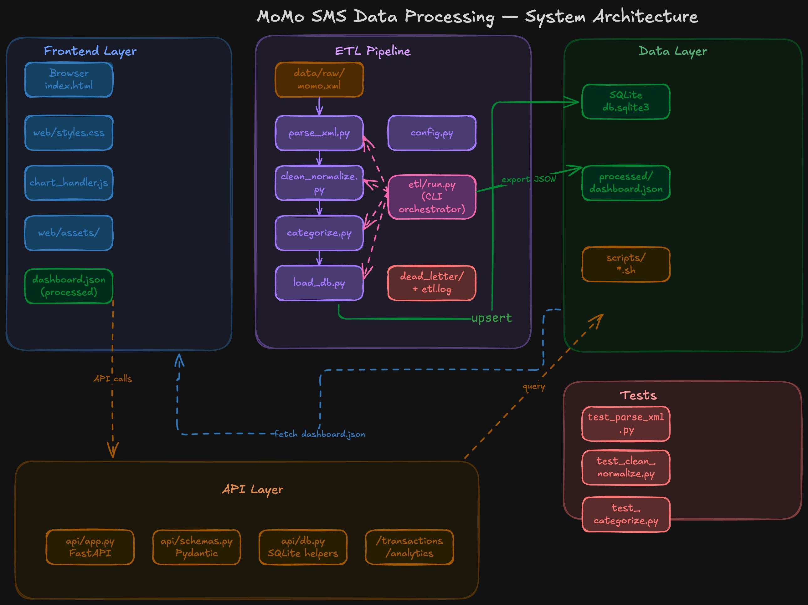

# Momo-SMS-API

## MoMo SMS API — Week 3

A REST API for managing MoMo SMS transaction data, built on Python's standard-library `http.server`. Includes Basic Authentication, in-memory CRUD endpoints, an XML parser, and a DSA comparison between linear search and dictionary lookup.

## Scrum board

Tasks tracked on [Team Astro Jira](https://aluteam-6.atlassian.net/jira/software/projects/SCRUM/boards/1?atlOrigin=eyJpIjoiN2YyYjdiY2JmNTBlNDI2ZDlkOWYzOTdhYzk1MjEwODQiLCJwIjoiaiJ9).

## Task Sheet

Task Sheet in Excel [Team Atro Sheet](https://docs.google.com/spreadsheets/d/1KM57EwXgdUIjaITl2LJDZ698i8mUo3kLCOP4R7gL0AQ/edit?usp=sharing)


## Quick start

```bash
# 1. Clone the repo and enter it
git clone https://github.com/n-elie7/momo-sms
cd momo-sms

# 2. Make sure Python 3.10+ is installed
python3 --version

# 3. (Optional) Place the SMS XML at data/modified_sms_v2.xml
#    The server will look there first.

# 4. Start the API
python3 api/server.py

# Server prints:
#   Loading transactions from data/modified_sms_v2.xml...
#   Loaded 1691 transactions into memory
#   MoMo API running at http://localhost:8080
```

No `pip install` is required — everything uses the Python standard library.

## Trying the API

In a second terminal:

```bash
# List all
curl -u admin:momo2026 http://localhost:8080/transactions

# Get one
curl -u admin:momo2026 http://localhost:8080/transactions/1

# Create
curl -u admin:momo2026 -X POST http://localhost:8080/transactions \
  -H "Content-Type: application/json" \
  -d '{"body":"Test transaction","amount":500,"category":"PAYMENT_CODE"}'

# Update
curl -u admin:momo2026 -X PUT http://localhost:8080/transactions/1 \
  -H "Content-Type: application/json" \
  -d '{"amount":9999}'

# Delete
curl -u admin:momo2026 -X DELETE http://localhost:8080/transactions/1
```

Without credentials or with wrong credentials, every endpoint returns **401 Unauthorized**.

Full endpoint documentation is in [`docs/api_docs.md`](docs/api_docs.md).

## Running the DSA benchmark

```bash
python3 dsa/search_comparison.py
```

Compares linear search against dictionary lookup over 1,000 random ID lookups on the full 1,691-record dataset. Sample output shows the dict is roughly 250× faster. Reflection and explanation are in [`docs/report.md`](docs/report.md).

## Project layout

```
momo-api/
├── api/
│   ├── server.py              ← HTTP server + routing
│   ├── auth.py                ← Basic Auth check + decoding
│   └── store.py               ← in-memory transaction store (CRUD)
├── dsa/
│   ├── parse_xml.py           ← XML → list of dicts
|    ├── suggest_algorithm
│   └── search_comparison.py   ← linear vs dict benchmark
├── data/
│   └── modified_sms_v2.xml    ← source SMS records (1,691)
├── docs/
│   ├── api_docs.md            ← endpoint reference
│   ├── report.md              ← project report (convert to PDF)
│   └── ai_usage_log.md        ← AI use disclosure
├── screenshots/               ← curl/httpie test screenshots
└── README.md
```

## Test credentials

| Username | Password |
|----------|----------|
| admin    | momo2026 |
| kaliza   | team_astro_2026 |
| elie     | team_astro_2026 |
| suwafa   | team_astro_2026 |

These are hard-coded in `api/auth.py` and intended for assignment grading only.

## Team

| Name | Role | Key contributions |
|------|------|-------------------|
| Niyubwayo Elie | Team lead — API & auth | `api/server.py`, `api/auth.py`, endpoint integration, project structure |
| Suwafa Iradukunda | DSA & testing | `dsa/parse_xml.py`, `dsa/search_comparison.py`, curl test screenshots |
| Kaliza Sabrina | Storage & docs | `api/store.py`, `docs/api_docs.md`, `docs/report.md`, `dsa/suggest_algorithm.md`, README |

*Each member's specific commits are visible in the GitHub log.*


## Overview

In MoMo SMS API data will be processed in XML format, clean and categorize the data, store it in a relational database, and build a frontend interface to analyze and visualize the data.

## Team Astro

### Members:

- Niyubwayo Irakoze Elie
- Iradukunda Suwafa
- Kaliza Sabrina

## Architecture Diagram


## AI Usage Log
This section lists how we used AI through out this project

We used AI to:

- Analyze XML data structure to get the big picture of database we are about to design
- Write comments on columns we specified in the schema
- To research on MySQL best practices like InnoDB, there was no need to specify it explicitly. That nowadays it comes as pre-configured engine ready to use
- check grammar and syntax checking in documentation file like README and erd_design_justification markdown file


## Database Documentation

This section explains the entities, their roles, and the relationships between them.

### Overview

The MoMo SMS pipeline database runs on MySQL and is built on six relational tables that together capture every stage of SMS processing — from raw ingestion through to fully parsed financial records with their participants and processing logs. The schema is intentionally normalized: each piece of information lives in exactly one place, and the tables are stitched together with foreign keys so the data stays consistent even as it grows.

### The six entities

**`users`** holds every party seen across the SMS feed — the account holder, other MoMo customers, agents, and businesses. Phone numbers and account numbers are stored where available, and an `is_anonymized` flag marks records where the phone number was masked in the original SMS (e.g. `*********013`). A `user_type` column distinguishes the account holder (`self`), regular customers, agents, and businesses, so queries can filter by role without parsing names.

**`transaction_categories`** is a controlled list of transaction types — incoming receive, payment to merchant code, transfer to phone, bank deposit, agent withdrawal, airtime, MTN Cash Power, direct payment, and OTP. Each category carries a `direction` field (`credit`, `debit`, or `info`) which makes "how much did I spend this month" queries trivial without inspecting amounts manually. Treating categories as a lookup table rather than a hard-coded enum means new MoMo product types can be added by inserting a row, not by altering the schema.

**`raw_sms`** preserves every original SMS body verbatim, alongside its address, timestamp, and a SHA-256 `body_hash` used as a deduplication key. Keeping the raw payload separate from parsed data means the team can re-parse historical SMS later if the extraction logic improves, without touching clean records. A `parse_status` field tracks whether each SMS is pending, parsed, failed, or ignored.

**`transactions`** is the central fact table — one row per parsed financial event. It carries the universal attributes (`amount`, `fee`, `currency`, `new_balance`, `tx_timestamp`, `status`), plus optional fields for vendor tokens (cash power, airtime) and free-text notes. Each row links back to its source via `raw_sms_id` and to its type via `category_id`. The `status` column supports reversal tracking, and CHECK constraints prevent negative amounts or fees from ever being inserted.

**`transaction_participants`** is the junction table that resolves the many-to-many relationship between users and transactions. A single transaction often involves multiple parties in distinct roles — for example, an agent withdrawal has the account holder as `sender` and the agent as `agent`. A simple sender/receiver pair on `transactions` couldn't represent this, so each participant is its own row with an explicit `role` (`sender`, `receiver`, `agent`, or `merchant`). A composite unique constraint on `(transaction_id, user_id, role)` prevents the same user being assigned the same role twice on one transaction.

**`system_logs`** captures ETL pipeline events — successful parses, duplicate ingests, regex failures, and anomalies. Each log entry can optionally reference both a raw SMS and a resulting transaction (both foreign keys nullable), so any pipeline issue can be traced back to its source. A JSON `details_json` column stores structured context like the regex used or fields extracted, useful when debugging parse failures.

### How the tables connect

The relationships are straightforward once you see them laid out:

- One **category** has many **transactions** (1:M)
- One **raw_sms** maps to at most one **transaction** (1:1, since each parsed SMS produces one financial record)
- One **user** participates in many **transactions**, and one **transaction** has many **users** — resolved via **transaction_participants** (M:N)
- One **raw_sms** and one **transaction** can each have many **system_logs** (1:M from both sides)

Foreign keys are configured with deliberate ON DELETE policies: deleting a transaction cascades to its participants (they have no meaning on their own), but deleting a category is restricted if transactions reference it (would orphan financial data), and deleting a raw SMS only sets the link on the transaction to NULL rather than removing the financial record.

### Design choices worth knowing

- **`DECIMAL(15,2)` for all monetary values** — `FLOAT` and `DOUBLE` suffer rounding errors that compound across millions of rows. `DECIMAL` is exact, which is non-negotiable for financial data.
- **`ENGINE=InnoDB` on every table** — MySQL's default engine, but specified explicitly. InnoDB is what makes the foreign keys actually enforce (the older MyISAM engine silently ignores them) and what enables transactions, row-level locking, and crash recovery.
- **`utf8mb4` character set** — supports the full Unicode range including emoji and non-Latin scripts that occasionally appear in SMS bodies.
- **Indexes on the high-traffic columns** — `tx_timestamp`, `category_id`, `status`, and `external_tx_ref` on transactions; `parse_status` and `sms_date_ms` on raw_sms; the FK columns on the junction table. Reporting queries hit these constantly, so they're indexed up front.
- **`body_hash` UNIQUE constraint on raw_sms** — guarantees the pipeline never ingests the same SMS twice, even if the source XML is re-imported.

### JSON representation

The JSON examples in `examples/json_schemas.json` mirror this relational structure but flatten it for API consumers. Instead of returning foreign key integers, related data is nested: a transaction object embeds its full category, its participants as an array of `{role, user}` pairs, and optionally its source SMS and processing logs. This means a client gets the entire context of a transaction in a single response without joining or making follow-up requests, while the underlying database keeps the normalized structure that makes storage and analysis efficient.

