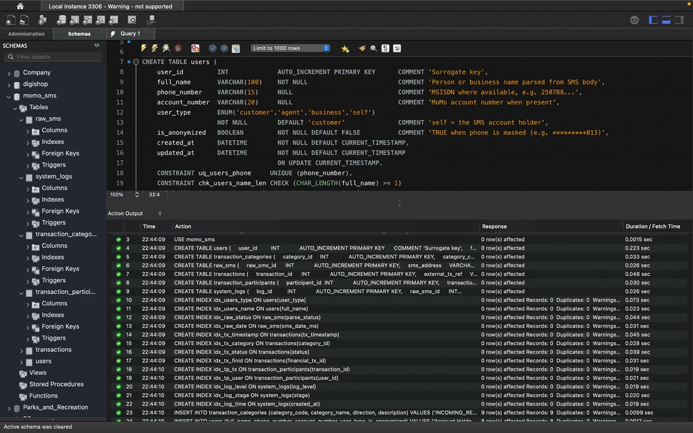
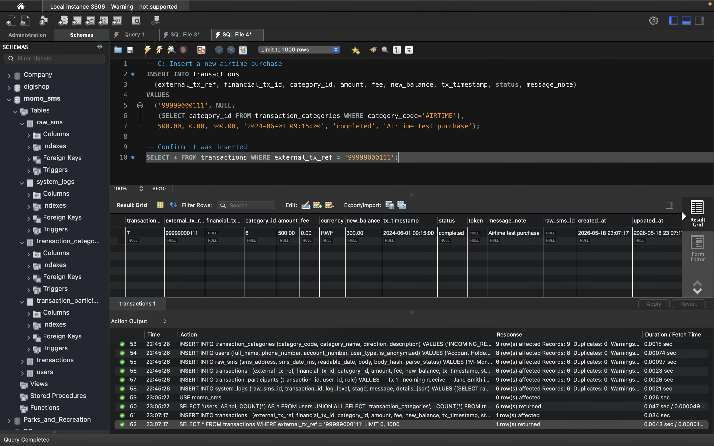
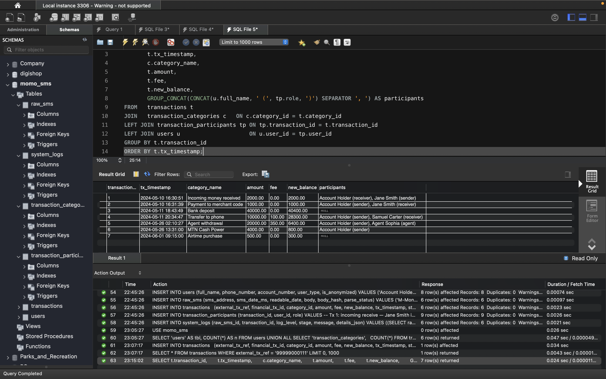
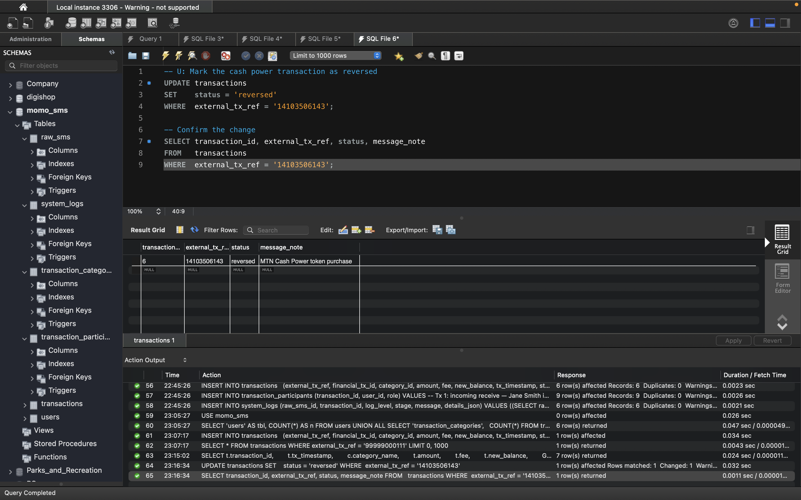
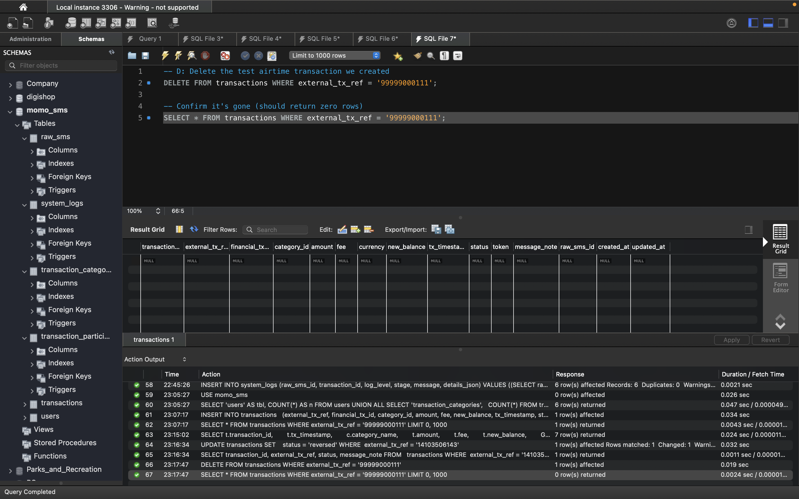

# MySQL CRUD Test Results

## Setup
Loaded db_setup.sql via MySQL Workbench. All tables created and seed data
inserted without errors.

Row counts after setup:
- users: 8
- transaction_categories: 9
- raw_sms: 6
- transactions: 6
- transaction_participants: 9
- system_logs: 6

## CREATE
Inserted a new airtime transaction with reference 99999000111.

## READ
Queried all transactions joined with category and participants.

## UPDATE
Marked the cash power transaction (ref 14103506143) as reversed.

## DELETE
Removed the test airtime transaction. SELECT confirms it's gone.

## Conclusion
All CRUD operations succeeded. Foreign keys, CHECK constraints, and indexes
are working as designed. The schema is ready for the ETL pipeline.
